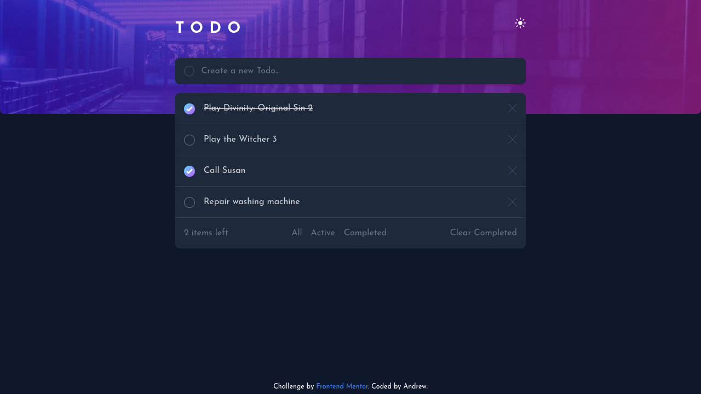

# Frontend Mentor - Todo app solution

This is a solution to the [Todo app challenge on Frontend Mentor](https://www.frontendmentor.io/challenges/todo-app-Su1_KokOW). Frontend Mentor challenges help you improve your coding skills by building realistic projects.

## Table of contents

- [Overview](#overview)
  - [The challenge](#the-challenge)
  - [Screenshot](#screenshot)
  - [Links](#links)
- [My process](#my-process)
  - [Built with](#built-with)
  - [What I learned](#what-i-learned)
  - [Useful resources](#useful-resources)
- [Author](#author)

## Overview

### The challenge

Users should be able to:

- View the optimal layout for the app depending on their device's screen size
- See hover states for all interactive elements on the page
- Add new todos to the list
- Mark todos as complete
- Delete todos from the list
- Filter by all/active/complete todos
- Clear all completed todos
- Toggle light and dark mode

### Screenshot



### Links

- Solution URL: [frontendmentor.io](https://www.frontendmentor.io/solutions/todo-app-using-react-and-redux-dyXO0R4NM)
- Live Site URL: [whoamihealay.github.io/todo-app-react/](https://whoamihealay.github.io/todo-app-react/)

## My process

### Built with

- Semantic HTML5 markup
- TailwindCSS
- Mobile-first workflow
- [React](https://reactjs.org/) - JS library
- Redux
- Webpack 5

### What I learned

I re-learned Redux. I unsuccessfully used Redux in another project and used the Context API instead. This time I wanted to use Redux and, what better than a todo app for state management.

```
  let isLoading = status === "loading";
  let placeholder = isLoading ? "" : "Create a new Todo...";
  let loader = isLoading ? <div>Adding...</div> : null;
```

Reading through the redux documentation, I discover the isBool syntax and will use it a lot more.

### Useful resources

- [React Docs](https://reactjs.org/docs/getting-started.html)
- [Redux Docs](https://redux.js.org/introduction/getting-started)
- [Fireship.io](https://www.youtube.com/c/Fireship) - Awesome Youtube channel. Fireship.io has a "Concept/framework in 100sec" playlist to quickly learn the very basics of a Programming language, framework, or concept. There are also longer videos for more in-depth frontend mini-projects (CSS grid, flex...)
- [Brad Taversy](https://www.youtube.com/c/TraversyMedia) - Awesome Youtube Channel and Udemy course on react and the Context library. I followed his React Crash Course and Udemy course on React.
- [Kevin Powell](https://www.youtube.com/kepowob) - Discovered on FrontendMentor with the partnership on the Space challenge and where my CSS game step up to all new level.
- [Google](google.com) - Last but not least, the ultimate bug solver!

## Author

- Website - [whoamiandrew.com](https://whoamiandrew.com)
- Frontend Mentor - [@whoamihealay](https://www.frontendmentor.io/profile/whoamihealay)
- Linkedin - [@andrewsouthern01](https://www.linkedin.com/in/andrewsouthern01/)
